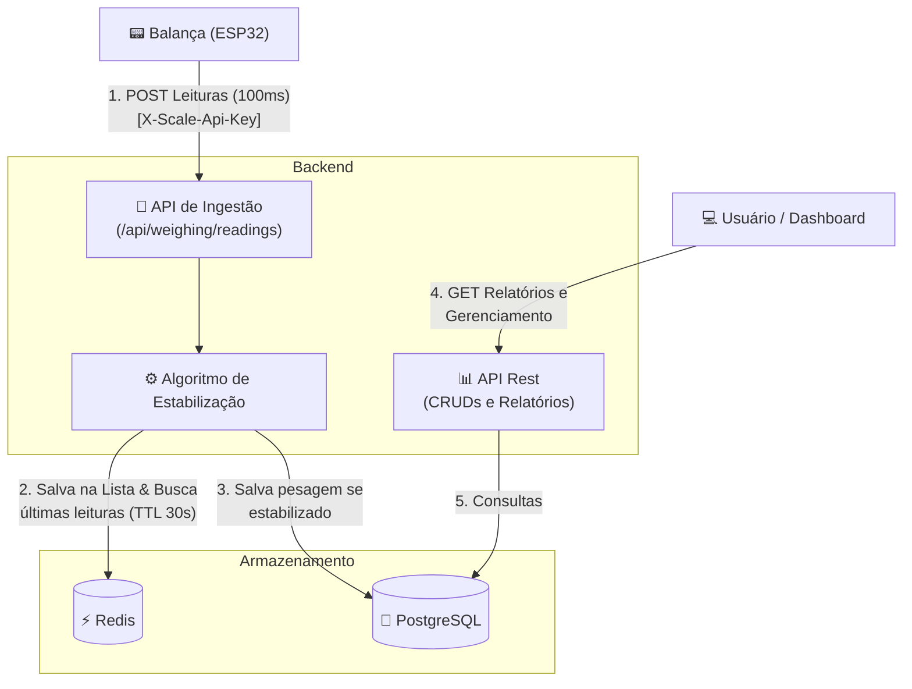

# Sistema de Pesagem de Grãos

API REST para ingestão, estabilização e armazenamento de pesagens de balanças automatizadas em uma empresa de transporte de grãos.

## Stack

- Java 25 (GraalVM)
- Spring Boot 3.4
- PostgreSQL 16
- Redis 7
- Flyway (migrations)
- Swagger/OpenAPI

## Arquitetura (System Design)

Abaixo está o fluxo de dados do sistema, demonstrando como as leituras de alta frequência da balança são processadas e armazenadas:



## Como executar

### Pré-requisitos
- Docker e Docker Compose
- Java 25
- Maven

### 1. Executar a aplicação e infraestrutura (PostgreSQL + Redis + Aplicação)
```bash
docker-compose up -d
```

### 2. Acessar Swagger UI
```
http://localhost:8080/swagger-ui.html
```

### 3. Relatórios
```
http://localhost:8080/index.html
```

## Dados de exemplo

A aplicação já vem com dados pré-cadastrados:

| Entidade | Dados |
|---|---|
| Filiais | Curitiba, Londrina |
| Grãos | Soja (R$1500/ton), Milho (R$900/ton), Trigo (R$1200/ton) |
| Caminhões | ABC1D23 (tara: 8500kg), XYZ9F87 (tara: 9200kg) |
| Balanças | SCALE-001 (api key: `sk-balanca-001-abc123`), SCALE-002 |
| Transação | Caminhão ABC1D23 buscando Soja (status: IN_TRANSIT) |

## Simulando o ESP32

Enviar leituras de peso para a balança:

```bash
# Enviar várias leituras simulando oscilação e estabilização
curl -X POST http://localhost:8080/api/weighing/readings \
  -H "Content-Type: application/json" \
  -H "X-Scale-Api-Key: sk-balanca-001-abc123" \
  -d '{"id": "SCALE-001", "plate": "ABC1D23", "weight": 25430}'
```

Quando 10 leituras consecutivas tiverem desvio padrão menor que 50kg, o peso é considerado estabilizado e a pesagem é persistida automaticamente.

> **Nota de Configuração:** Você pode ajustar alguns parâmetros no arquivo `src/main/resources/application.yml`, nas propriedades `stabilization.std-dev-threshold` e `stabilization.window-size`.

## Algoritmo de Estabilização

**Estratégia: Sliding Window + Desvio Padrão**

1. Cada leitura é armazenada numa Redis List (chave: `scale:{id}:plate:{plate}`)
2. A cada nova leitura, a janela (ex: últimas 10 leituras) é analisada
3. Se o desvio padrão da janela for menor que o limiar configurado (ex: 50kg) → peso estabilizado (média da janela)
4. TTL configurável (ex: 30s) no Redis limpa buffers órfãos automaticamente

**Por que Redis?** O ESP32 envia a cada 100ms — Redis suporta essa frequência com latência de ~1ms, e o TTL elimina a necessidade de scheduler para limpeza.

## Endpoints

### CRUDs
- `POST/GET/PUT/DELETE /api/branches`
- `POST/GET/PUT/DELETE /api/trucks`
- `POST/GET/PUT/DELETE /api/grain-types`
- `POST/GET/PUT/DELETE /api/scales`
- `POST/GET/PUT /api/transactions`

### Ingestão (ESP32)
- `POST /api/weighing/readings` → 202 Accepted

### Relatórios
- `GET /api/reports/grain-summary` — resumo por tipo de grão
- `GET /api/reports/weighing-history?startDate=...&endDate=...` — histórico de pesagens
- `GET /api/reports/weighing-history/plate/{plate}` — pesagens por placa

## Autenticação das Balanças

Cada balança possui uma `apiKey`. O ESP32 deve enviar o header `X-Scale-Api-Key` nas requisições ao endpoint de ingestão. Requisições sem chave válida recebem 401.

## Sugestões de Evolução e Melhoria do Processo

Para evoluir este sistema em um cenário produtivo de alta volumetria e criticidade, sugiro as seguintes melhorias arquiteturais e operacionais:

**1. Arquitetura e Resiliência**
- **Mensageria:** Substituir a ingestão HTTP direta por um broker de mensageria. O dispositivo envia os dados para um tópico/fila e *consumers* processam a estabilização. Isso garante tolerância a falhas (zero perda de dados).
- **Circuit Breaker:** Implementar padrões de resiliência (Resilience4j) para proteger o sistema caso o banco de dados principal ou o Redis apresentem instabilidade.
- **Idempotência Plena nas Retentativas:** A API de ingestão atual é parcialmente idempotente, pois a janela do Redis absorve múltiplas leituras repetidas naturalmente. No entanto, para casos onde a balança faz retentativas cegas (ex: falha de rede gera um timeout, e ele reenvia um pacote que já havia chegado), o ideal é que a requisição contenha um identificador único ou *timestamp* de origem. Assim, o backend pode rejeitar ou ignorar pacotes duplicados em cenários de alta concorrência, garantindo uma API 100% idempotente.

**2. Escalabilidade e Performance**
- **Escalabilidade Horizontal:** Como o buffer de estabilização utiliza Redis, a aplicação é nativamente *stateless*. Pode-se adicionar facilmente múltiplas réplicas do backend atrás de um Load Balancer.

**3. Monitoramento e Manutenção**
- **Atualização Real-time (WebSockets):** Implementar comunicação bidirecional com o frontend. Os fiscais poderiam acompanhar pelo tablet/dashboard a balança se estabilizando ao vivo, em vez de esperar a conclusão ou fazer *polling*.
- **Alertas de Calibragem:** Se uma balança específica passa a demorar muito mais do que a média para estabilizar, o sistema dispara um alerta proativo de manutenção/calibragem, evitando paralisações não planejadas na operação.
